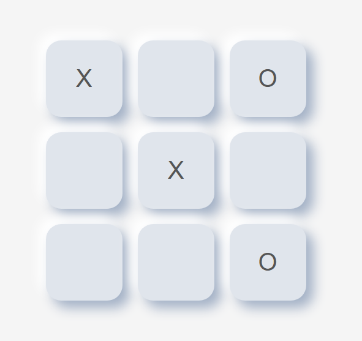
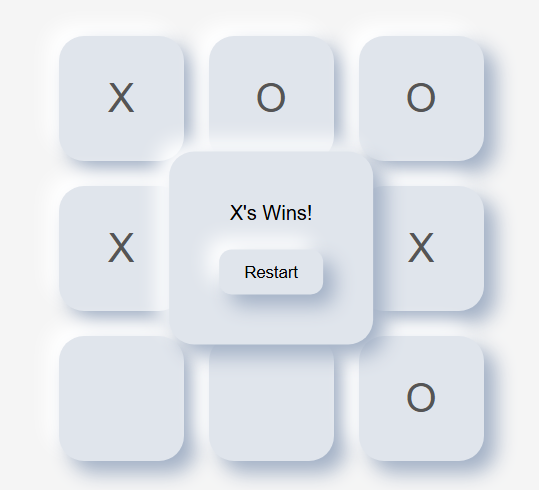
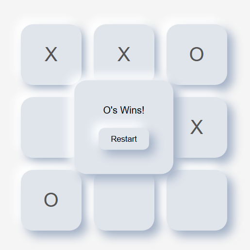

# ❌⭕ Tic-Tac-Toe Game

---

## 📋 Table of Contents
- 🏷️ [Project Description](#project-description)
- 💻 [Live Demo](#live-demo)
- 📷 [Screenshots](#screenshots)
- ✨ [Features](#features)
- 🛠️ [Technologies](#technologies)
- 🗂️ [Project structure](#project-structure)
- 💾 [Installation](#installation)
- 🫱🏻‍🫲🏼 [Contributing](#contributing)
- 📜 [License](#license)
- 👨🏻‍💻 [Author](#author--acknowledgments--contact) / 🙏🏻 [Acknowledgments](#author--acknowledgments--contact) / 📩 [Contact](#author--acknowledgments--contact)
- 💰 [Support Me!](#if-you-want-to-support-me)

---

## Project description
A clean, responsive Tic-Tac-Toe (X and O) game built using **HTML**, **CSS**, and **Vanilla JavaScript**. No libraries, no dependencies — just pure front-end.

---

## Live Demo
[⛓️‍💥 Demo](https://web-tic-tac-toe-game-eight.vercel.app/)

---

## Screenshots
<p align="center">
  
</p>

<br>

<p align="center">
  
  
   
</p>

---

## Features
- 2-player mode with alternating turns.
- Simple win/draw detection logic.
- Responsive design for small screens.
- Animated hover effects and winning message.
- Restart button to reset the game state.

---

## Technologies
- HTML5
- CSS3
- Vanilla JavaScript

---

## Project Structure
- 📁 tic-tac-toe-game/
- ├── index.html
- ├── style.css
- ├── script.js
- ├── screenshots/
- │   └── draw.png
- │   └── x-win.png
- │   └── o-win.png
- │   └── tic-tac-toe.png
- ├── LICENSE
- ├── README.md
- └── .gitignore
<!-- ## Requirements -->

---

## Installation
- No build tools or servers required.
1. Clone the repo:
```bash
git clone https://github.com/xAndreiix/Web_Tic_Tac_Toe_Game.git
```
```bash
cd tic-tac-toe-game
```
2. Open index.html in any browser.
<!-- ## Usage -->
<!-- ## Configuration -->
<!-- ## Runing tests -->
<!-- ## Deployment -->
<!-- Notes -->
<!-- ## Road Map -->
<!-- ## FAQ -->
---

## Contributing
Pull requests are welcome.
For major changes, please open an issue first to discuss what you’d like to change.
<!-- ## Changelog -->

---

## License
This project is licensed under the MIT License - see the [LICENSE](LICENSE)

---

## Author / Acknowledgments / Contact
**Author:** 
Andrei Iliescu

[](https://xandreiix.github.io/Andrei-Iliescu-Portfolio/)

**Acknowledgments:**  
- Inspired by [@i.code4u](https://www.tiktok.com/@i.code4u) tutorial on TikTok.

[](https://www.tiktok.com/@i.code4u/photo/7527571365814177046?is_from_webapp=1&sender_device=pc&web_id=7403075142698436128)
- All thanks to him for the tutorial!

**Contact:**  

[](https://linkedin.com/in/andrei-iliescu-aa7910214)<br>
[](mailto:andrey_iliescu@yahoo.com)<br>
[](mailto:andrei.iliescu13102000@gmail.com)

---

## If you want to support me
[](https://paypal.me/xAndreiix)<br>
[](https://revolut.me/xandreiix)
